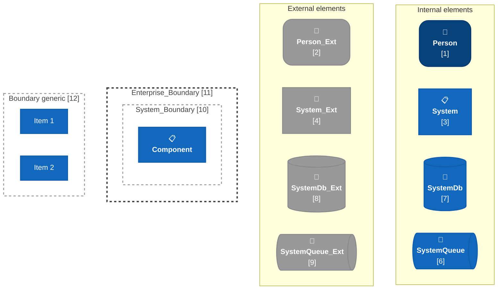
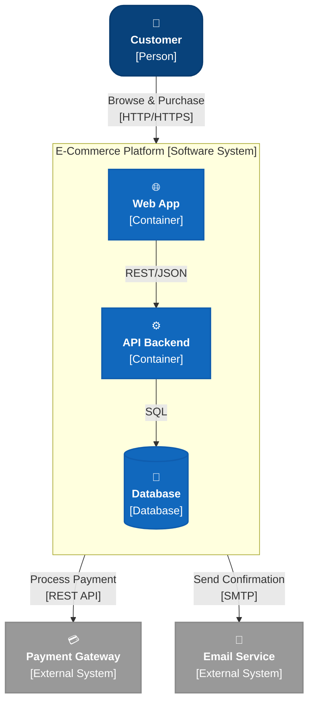
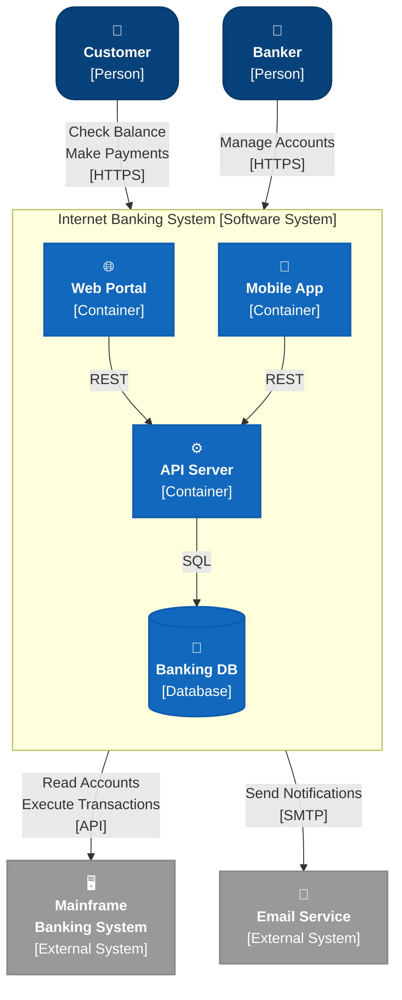
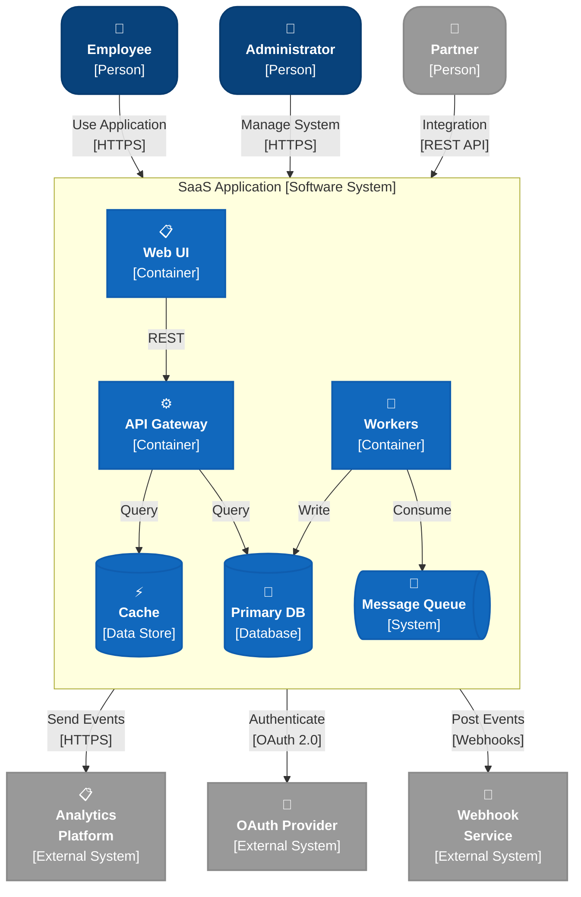
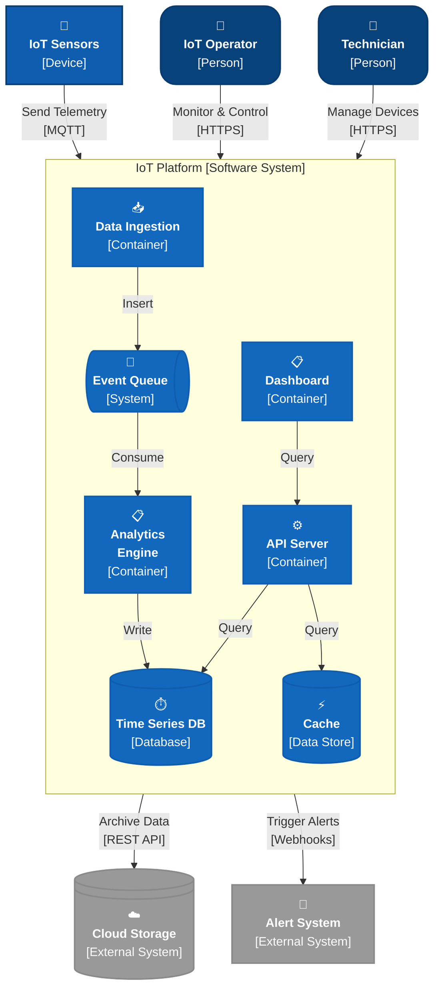
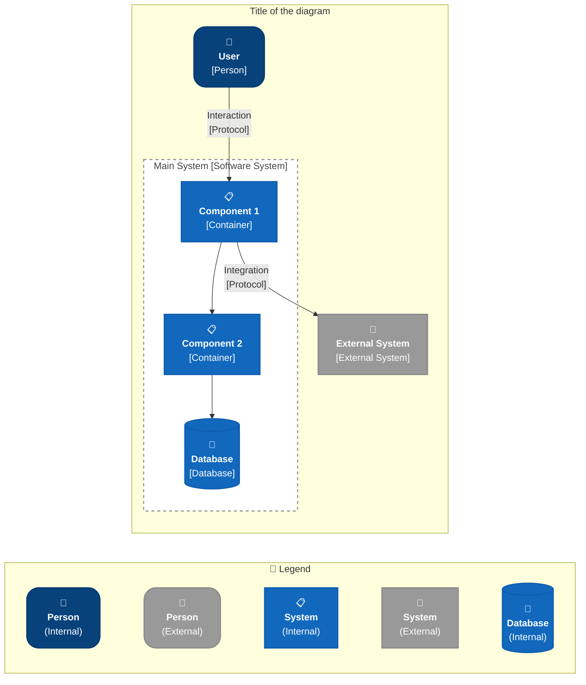

# C4 Context Diagram - Mermaid Flowchart Cheatsheet

<!-- Synced from C4-cheatsheets/C4-Context-Diagram-Mermaid-Flowchart-Cheatsheet.md on 2026-09-16. Keep in sync when the source changes. -->

> Using mermaid `flowchart` with C4 styling to replace mermaid's native C4Context that has limitations.

## Color Palette (C4 Blue Theme)

| Element                        | Color       | Hex       | Internal | External |
| ------------------------------ | ----------- | --------- | -------- | -------- |
| **Person**                     | Dark Blue   | `#08427b` | ✓        | -        |
| **Person**                     | Gray        | `#999999` | -        | ✓        |
| **System**                     | Medium Blue | `#1168bd` | ✓        | -        |
| **System**                     | Dark Gray   | `#999999` | -        | ✓        |
| **SystemDb**                   | Medium Blue | `#1168bd` | ✓        | -        |
| **SystemDb**                   | Dark Gray   | `#999999` | -        | ✓        |
| **SystemQueue**                | Medium Blue | `#1168bd` | ✓        | -        |
| **SystemQueue**                | Dark Gray   | `#999999` | -        | ✓        |
| **Boundary / System_Boundary** | Dashed Gray | `#999`    | -        | -        |
| **Enterprise_Boundary**        | Dashed Gray | `#999`    | -        | -        |
| **Text/Stroke**                | Dark Gray   | `#073b6f` | -        | -        |

---

## C4 PlantUML Elements → Mermaid Flowchart Mapping

| C4 PlantUML Element        | Mermaid Class        | Element Type           | Example    |
| -------------------------- | -------------------- | ---------------------- | ---------- |
| `Person(...)`              | `Person`             | Person (Internal)      | Element 1  |
| `Person_Ext(...)`          | `PersonExt`          | Person (External)      | Element 2  |
| `System(...)`              | `System`             | System (Internal)      | Element 3  |
| `System_Ext(...)`          | `SystemExt`          | System (External)      | Element 4  |
| `SystemDb(...)`            | `SystemDb`           | SystemDb (Internal)    | Element 7  |
| `SystemDb_Ext(...)`        | `SystemDbExt`        | SystemDb (External)    | Element 8  |
| `SystemQueue(...)`         | `SystemQueue`        | SystemQueue (Internal) | Element 6  |
| `SystemQueue_Ext(...)`     | `SystemQueueExt`     | SystemQueue (External) | Element 9  |
| `System_Boundary(...)`     | `SystemBoundary`     | System Boundary        | Element 10 |
| `Enterprise_Boundary(...)` | `EnterpriseBoundary` | Enterprise Boundary    | Element 11 |
| `Boundary(...)`            | `Boundary`           | Generic Boundary       | Element 12 |

---

## Element Index & Legend

All Context-level elements shown together, plus the C4-PlantUML macro each one maps to. Grab the matching `classDef` line(s) and node/subgraph syntax from the legend below — every snippet is self-contained and renders standalone.

| #   | C4 PlantUML                                 | Mermaid class                   | Shape            | Usage                             |
| --- | ------------------------------------------- | ------------------------------- | ---------------- | --------------------------------- |
| 1   | `Person(alias, label)`                      | `Person`                        | rounded rect     | Internal user/actor               |
| 2   | `Person_Ext(alias, label)`                  | `PersonExt`                     | rounded rect     | External user/actor               |
| 3   | `System(alias, label)`                      | `System`                        | rect             | Internal software system          |
| 4   | `System_Ext(alias, label)`                  | `SystemExt`                     | rect             | External software system          |
| 5   | `SystemDb(alias, label)`                    | `SystemDb`                      | cylinder         | Generic internal data store       |
| 6   | `SystemQueue(alias, label)`                 | `SystemQueue`                   | rect             | Internal message broker/event bus |
| 7   | `SystemDb(alias, label)`                    | `SystemDb`                      | cylinder         | Internal database                 |
| 8   | `SystemDb_Ext(alias, label)`                | `SystemDbExt`                   | cylinder         | External database                 |
| 9   | `SystemQueue_Ext(alias, label)`             | `SystemQueueExt`                | rect             | External message broker           |
| 10  | `System_Boundary(alias, label) { ... }`     | `SystemBoundary` (subgraph)     | dashed box       | Groups elements inside one system |
| 11  | `Enterprise_Boundary(alias, label) { ... }` | `EnterpriseBoundary` (subgraph) | thick dashed box | Groups one or more systems        |
| 12  | `Boundary(alias, label, type) { ... }`      | `Boundary` (subgraph)           | dashed box       | Generic/custom grouping           |

---

## Complete Context Diagram Example 1: Basic E-Commerce

---

## Complete Context Diagram Example 2: Banking System

---

## Complete Context Diagram Example 3: Multi-Tenant SaaS

---

## Complete Context Diagram Example 4: IoT System

---

## Styling Combinations

### Person with Different Icons

---

### System with Different Icons

---

> **Arrow styles and directional relationships:** see [C4-Relationships-Layouts-Cheatsheet.md](./C4-Relationships-Layouts-Cheatsheet.md) for `Rel`, `BiRel`, `Rel_U/D/L/R`, and arrow-style variations.

---

## Best Practices

### ✅ DO's

- Use consistent icon-emoji combinations per element type
- Always label with type in brackets: `[Person]`, `[Software System]`, `[Database]`, `[Container]`, `[External System]`
- Use subgraphs with `SystemBoundary` class to show system boundaries
- Keep descriptions concise (max 3 lines per element)
- Use dashed lines for optional/deprecated relationships
- Include protocol/technology in relationship labels

### ❌ DON'Ts

- Don't mix colors randomly—stick to the C4 palette
- Don't use inconsistent corner radius (rx/ry)—all persons should have `rx:20px,ry:20px`
- Don't forget stroke colors; they make shapes pop
- Don't create super dense diagrams—aim for max 6-8 elements per context
- Don't omit type labels—they're key to C4

---

## Copy-Paste Template

Use this as a starting point for your own context diagram:

### Warning

Don't use relationships from boundary elements directly; always connect through the components inside the boundary. Styling will not be applied correctly if you connect to the boundary itself.

> See the [README](./README.md#mermaid-rendering-tip) for a Mermaid rendering config tip.
