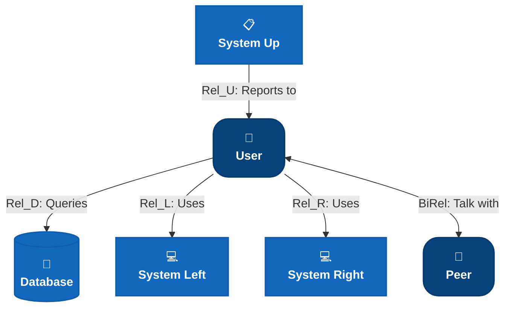
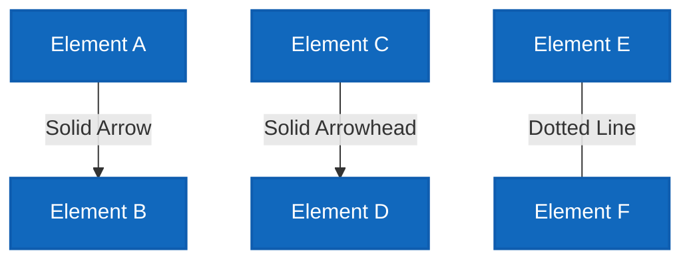
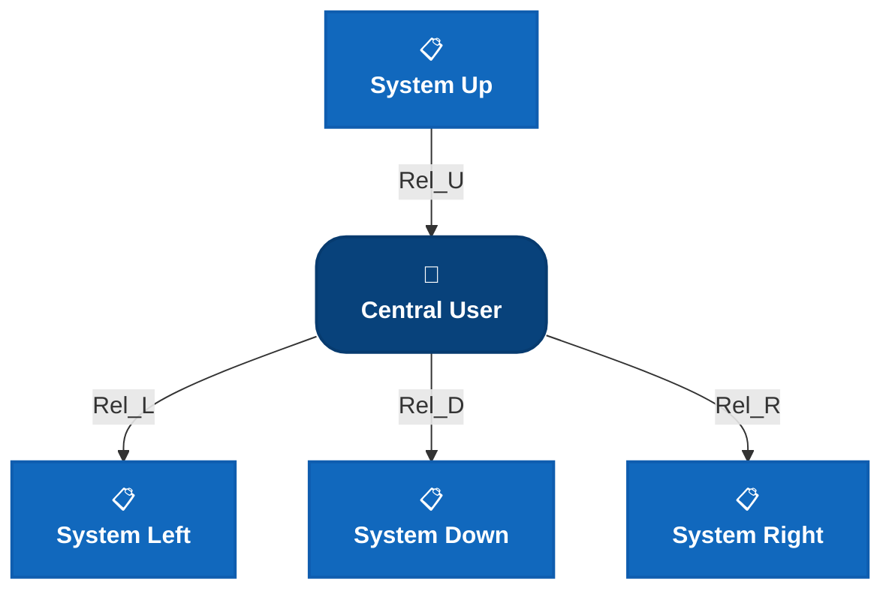
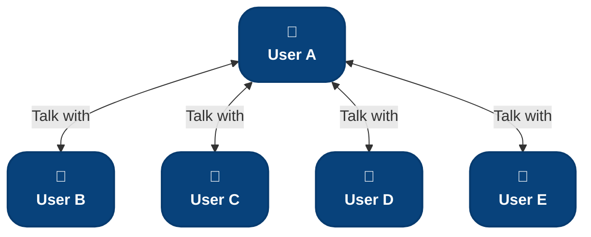

# C4 Relationships & Layouts - Mermaid Flowchart Cheatsheet

<!-- Synced from C4-cheatsheets/C4-Relationships-Layouts-Cheatsheet.md on 2026-09-16. Keep in sync when the source changes. -->

> Translating C4 PlantUML relationship and layout directives to mermaid `flowchart` syntax.

---

## Overview: Relationship vs Layout

| Type             | Purpose                                            | Example              | When to Use                                   |
| ---------------- | -------------------------------------------------- | -------------------- | --------------------------------------------- |
| **Relationship** | Shows **interaction** between two elements         | `Rel(A, B, "calls")` | Systems communicate, data flows, dependencies |
| **Layout**       | Arranges elements **without implying interaction** | `Lay_D(A, B)`        | Grouping visually, spacing, positioning       |

---

## Relationship Types & Directional Legend

All relationship macros shown together in one diagram, plus the C4-PlantUML macro each one maps to.



| Macro                                  | Mermaid arrow | Direction hint | Usage |
| -------------------------------------- | ------------- | -------------- | ----- | ------------------------------------ | --------------------------- |
| `Rel(from, to, label, ?tech)`          | `A -->        | "label"        | B`    | none (default `flowchart TB`)        | One-directional interaction |
| `BiRel(from, to, label, ?tech)`        | `A <-->       | "label"        | B`    | none                                 | Mutual/two-way interaction  |
| `Rel_U(from, to, label)` / `Rel_Up`    | `A -->        | "label"        | B`    | render with `flowchart BT`           | Arrow points up             |
| `Rel_D(from, to, label)` / `Rel_Down`  | `A -->        | "label"        | B`    | render with `flowchart TB` (default) | Arrow points down           |
| `Rel_R(from, to, label)` / `Rel_Right` | `A -->        | "label"        | B`    | render with `flowchart LR`           | Arrow points right          |
| `Rel_L(from, to, label)` / `Rel_Left`  | `A -->        | "label"        | B`    | render with `flowchart RL`           | Arrow points left           |

**Note:** Mermaid flowcharts have no per-edge direction override like C4-PlantUML's `Rel_U/D/L/R` — direction is controlled by the `flowchart` direction (`TB`, `BT`, `LR`, `RL`) declared once at the top of the diagram. Pick the orientation that matches the dominant flow you want to highlight.

---

## Relationship Arrow Styles in Mermaid

### Arrow Style Variations



**Mermaid Arrow Types:**

- `-->` — Standard arrow (solid line with arrowhead)
- `---|` — Text on line without arrow
- `-.->` — Dashed arrow
- `==>` — Double-stroke arrow (thick)
- `o-->` — Circle start
- `<--` — Reverse arrow

---

## Complete Example 1: Star Topology (All Directions)



**C4 PlantUML Equivalent:**

```
Person(center, "Central User")
System(sysUp, "System Up")
System(sysDown, "System Down")
System(sysLeft, "System Left")
System(sysRight, "System Right")

Rel_U(sysUp, center, "Rel_U")
Rel_D(center, sysDown, "Rel_D")
Rel_L(center, sysLeft, "Rel_L")
Rel_R(center, sysRight, "Rel_R")
```

---

## Complete Example 2: Bidirectional Network



**C4 PlantUML Equivalent:**

```
Person(userA, "User A")
Person(userB, "User B")
Person(userC, "User C")
Person(userD, "User D")
Person(userE, "User E")

BiRel_U(userA, userB, "Talk with")
BiRel_R(userA, userC, "Talk with")
BiRel_D(userA, userD, "Talk with")
BiRel_L(userA, userE, "Talk with")
```

---

## Best Practices for Relationships & Layouts

### ✅ DO's

- **Use directional relationships** (`Rel_U`, `Rel_D`, `Rel_L`, `Rel_R`) to control arrow direction and diagram layout
- **Label all relationships** with interaction type and protocol where relevant
- **Use bidirectional** (`BiRel`) for true peer-to-peer or mutual interactions
- **Separate concerns** — use `Rel_*` for interactions, `Lay_*` for pure positioning
- **Keep diagrams sparse** — avoid crossing arrows by using directional hints
- **Use layout constraints** when elements have no logical relationship but need visual grouping

### ❌ DON'Ts

- **Don't use undirected relationships** unless truly bidirectional
- **Don't mix too many directions** in one diagram — it becomes hard to read
- **Don't create circular relationship chains** without bidirectional arrows
- **Don't force layout with Lay*\* if a Rel*\* makes more semantic sense**
- **Don't leave relationships unlabeled** — always specify the interaction type

---

## Mermaid Direction Guide for Relationships

| Flow Direction    | Best Mermaid Config      | Rel Type  | Example                  |
| ----------------- | ------------------------ | --------- | ------------------------ |
| **Top-to-Bottom** | `flowchart TB` (default) | `Rel_D()` | User → System → Database |
| **Bottom-to-Top** | `flowchart BT`           | `Rel_U()` | Database ← System ← User |
| **Left-to-Right** | `flowchart LR`           | `Rel_R()` | Source → Target          |
| **Right-to-Left** | `flowchart RL`           | `Rel_L()` | Target ← Source          |

---
