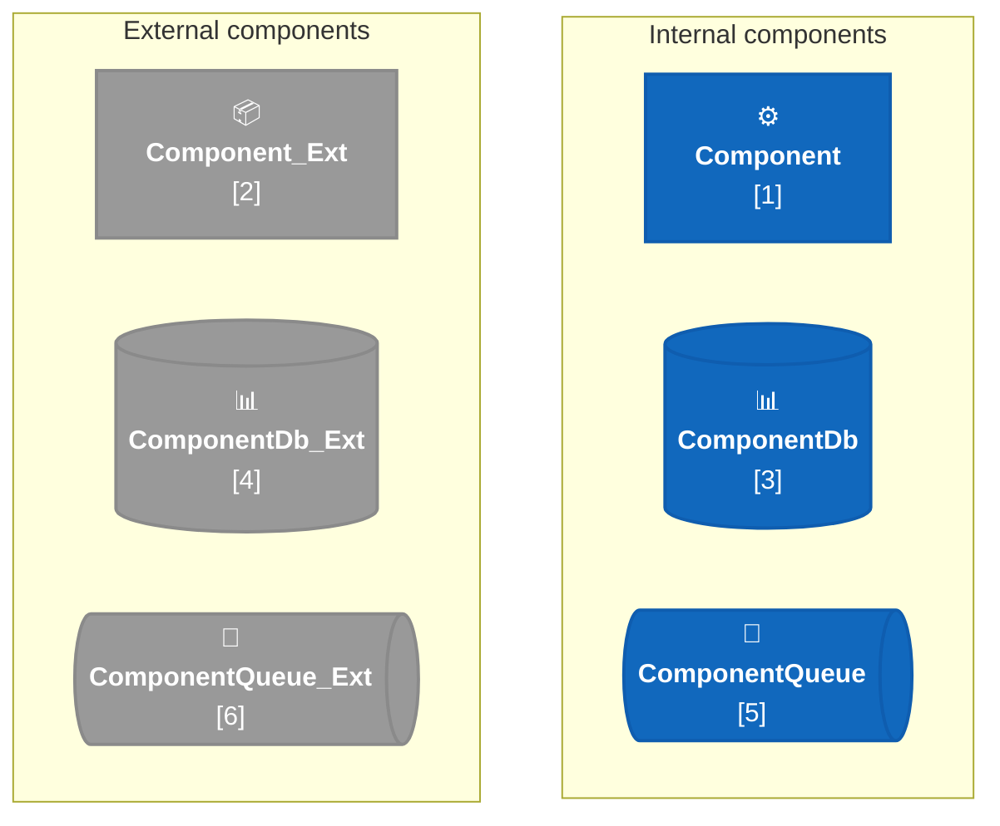
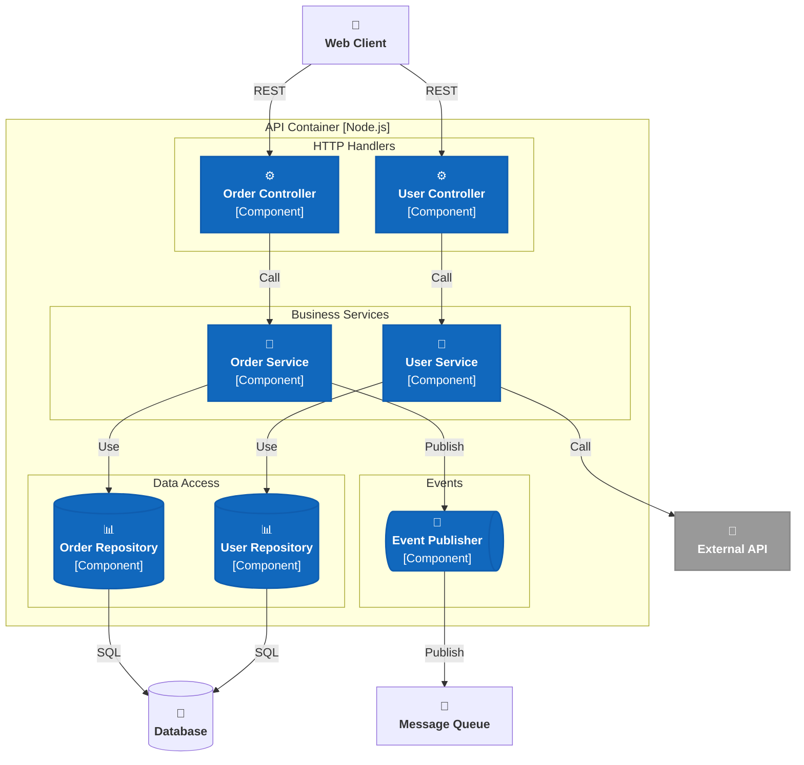
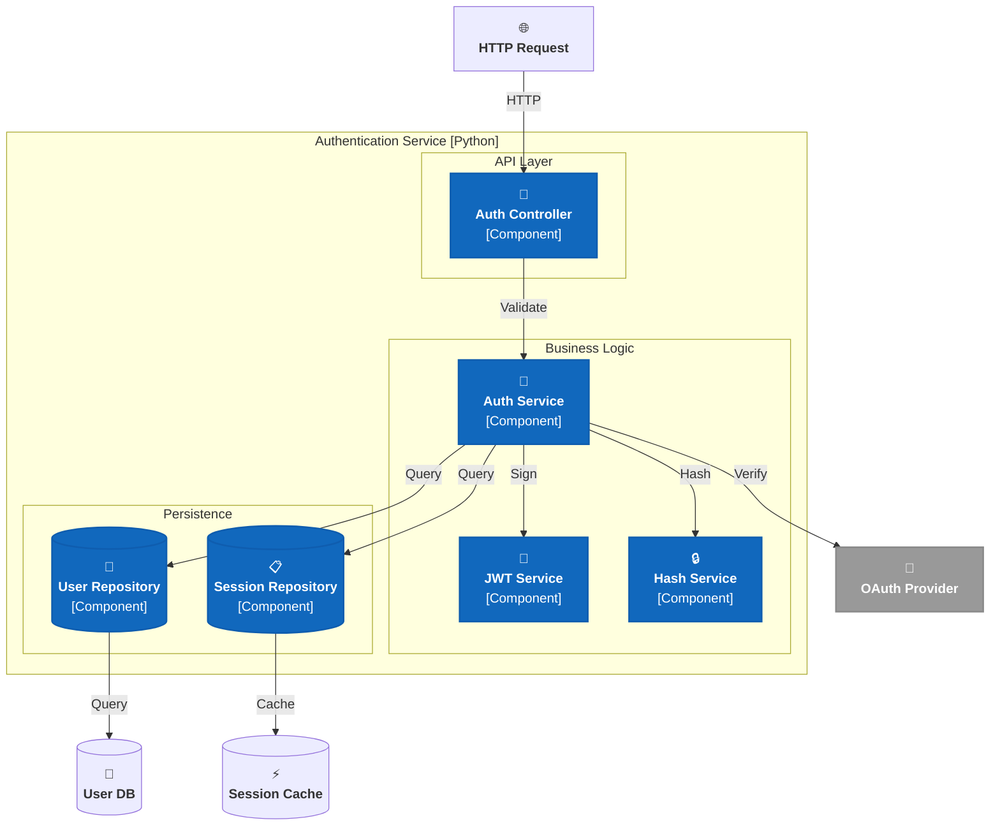
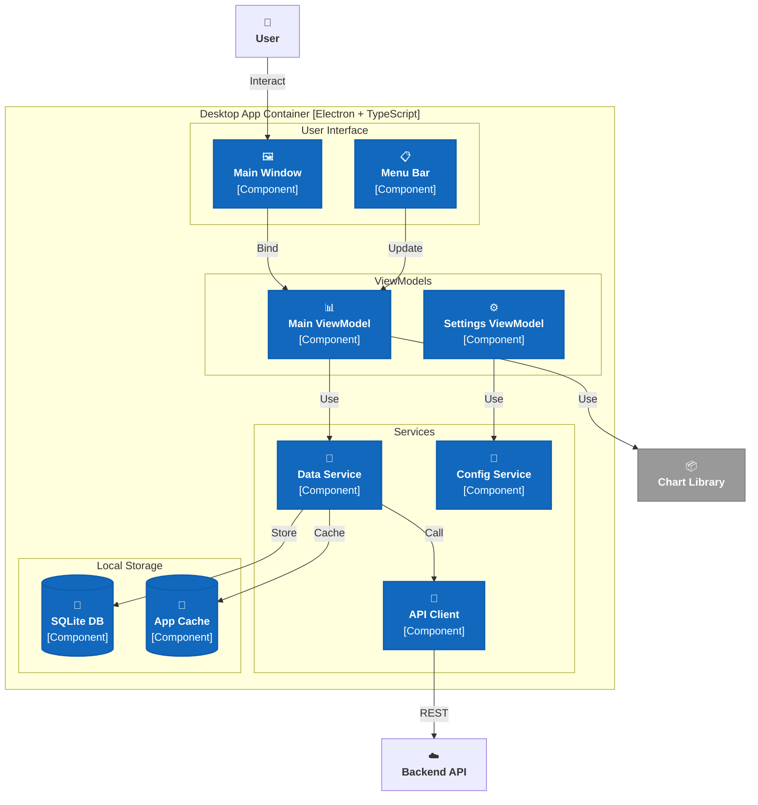
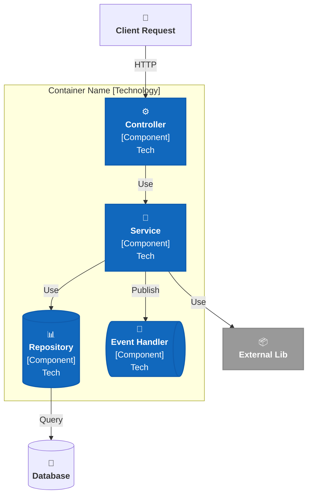

# C4 Component Diagram - Mermaid Flowchart Cheatsheet

> Component diagrams show the internal structure of a container. Components represent modular, independently replaceable units within a single deployable container (classes, libraries, modules, etc.).

---

## Color Palette (C4 Blue Theme)

| Element            | Color       | Hex       | Internal | External |
| ------------------ | ----------- | --------- | -------- | -------- |
| **Component**      | Medium Blue | `#1168bd` | ✓        | -        |
| **Component**      | Dark Gray   | `#999999` | -        | ✓        |
| **ComponentDb**    | Medium Blue | `#1168bd` | ✓        | -        |
| **ComponentDb**    | Dark Gray   | `#999999` | -        | ✓        |
| **ComponentQueue** | Medium Blue | `#1168bd` | ✓        | -        |
| **ComponentQueue** | Dark Gray   | `#999999` | -        | ✓        |
| **Text/Stroke**    | Dark Gray   | `#073b6f` | -        | -        |

---

## C4 PlantUML Elements → Mermaid Flowchart Mapping

| C4 PlantUML Element       | Mermaid Class       | Element Type              | Example   |
| ------------------------- | ------------------- | ------------------------- | --------- |
| `Component(...)`          | `Component`         | Component (Internal)      | Element 1 |
| `Component_Ext(...)`      | `ComponentExt`      | Component (External)      | Element 2 |
| `ComponentDb(...)`        | `ComponentDb`       | ComponentDb (Internal)    | Element 3 |
| `ComponentDb_Ext(...)`    | `ComponentDbExt`    | ComponentDb (External)    | Element 4 |
| `ComponentQueue(...)`     | `ComponentQueue`    | ComponentQueue (Internal) | Element 5 |
| `ComponentQueue_Ext(...)` | `ComponentQueueExt` | ComponentQueue (External) | Element 6 |

---

## Element Index & Legend

All Component-level elements shown together, plus the C4-PlantUML macro each one maps to. Grab the matching `classDef` line(s) and node syntax from the legend below — every snippet is self-contained and renders standalone.



| #   | C4 PlantUML                                     | Mermaid class       | Shape        | Usage                            |
| --- | ----------------------------------------------- | ------------------- | ------------ | -------------------------------- |
| 1   | `Component(alias, label, tech, descr)`          | `Component`         | rect         | Internal class/module/service    |
| 2   | `Component_Ext(alias, label, tech, descr)`      | `ComponentExt`      | rect         | External library/package         |
| 3   | `ComponentDb(alias, label, tech, descr)`        | `ComponentDb`       | cylinder     | Internal repository/DAO          |
| 4   | `ComponentDb_Ext(alias, label, tech, descr)`    | `ComponentDbExt`    | cylinder     | External data client/driver      |
| 5   | `ComponentQueue(alias, label, tech, descr)`     | `ComponentQueue`    | dashed shape | Internal event publisher/handler |
| 6   | `ComponentQueue_Ext(alias, label, tech, descr)` | `ComponentQueueExt` | dashed shape | External messaging client        |

---

## Complete Component Diagram Example 1: Web API Backend



---

## Complete Component Diagram Example 2: Microservice Architecture



---

## Complete Component Diagram Example 3: Desktop Application



---

## Component Design Patterns

### Common Component Patterns

| Pattern              | Description                       | Example Components               |
| -------------------- | --------------------------------- | -------------------------------- |
| **MVC**              | Model-View-Controller             | Controller, Service, Repository  |
| **MVVM**             | Model-View-ViewModel              | ViewModel, Model, DataService    |
| **Layered**          | Presentation-Business-Persistence | Controller, Service, Repository  |
| **Microkernel**      | Core + Plugin modules             | Kernel, Plugins, Plugin Registry |
| **Event-Driven**     | Event producers & consumers       | Publisher, Subscriber, EventBus  |
| **Ports & Adapters** | Hexagonal architecture            | Port, Adapter, Core Domain       |

---

## Best Practices for Component Diagrams

### ✅ DO's

- **Show internal organization** — How the container is structured
- **Include technology/framework** — Spring, Django, React, etc.
- **Use meaningful names** — Reflect actual classes/modules
- **Group by layer or feature** — Controllers, Services, Repositories, etc.
- **Show dependencies** — Component A depends on Component B
- **Include data stores** — Where components persist/access data
- **Use consistent styling** — All components follow same color/shape rules

### ❌ DON'Ts

- **Don't show individual methods** — That's code-level detail
- **Don't over-detail** — Component diagrams should be readable at a glance
- **Don't mix Container and Component levels** — Each diagram focuses on one level
- **Don't show every possible relationship** — Only significant dependencies
- **Don't forget technology labels** — Context on which framework/library is used
- **Don't create diagrams for every container** — Focus on complex or critical containers

---

## Copy-Paste Template: Complete Component Diagram



---

## C4 Model Progression: Context → Container → Component

```
Context Diagram
  └─ Shows overall system context and external systems

  Container Diagram (for selected system)
    └─ Shows deployment units (apps, databases, services)

      Component Diagram (for selected container)
      └─ Shows internal structure and modules

        Code Diagram (UML Class Diagrams)
        └─ Shows actual classes, methods, attributes
```

---

## Technology Stack Examples by Language

| Language     | Component Types                             | Example Stack                  |
| ------------ | ------------------------------------------- | ------------------------------ |
| **Java**     | Controller, Service, Repository, Manager    | Spring Boot, Hibernate, JPA    |
| **Python**   | Controller, Service, DAO, Manager           | Flask, SQLAlchemy, Django ORM  |
| **C#**       | Controller, Service, Repository, Manager    | ASP.NET Core, Entity Framework |
| **Node.js**  | Controller, Service, Repository, Middleware | Express, Sequelize, Mongoose   |
| **Go**       | Handler, Service, Repository, Manager       | Gin, GORM, sqlc                |
| **Frontend** | View, ViewModel, Service, Store             | React, Vue, Angular, Redux     |
