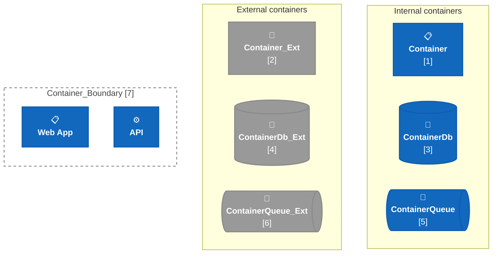
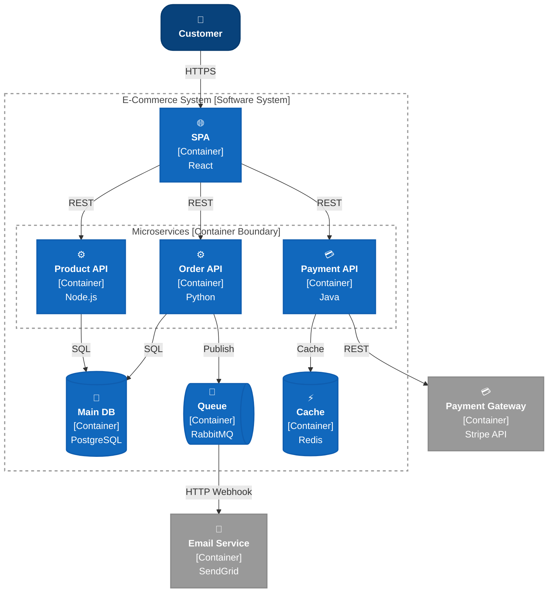
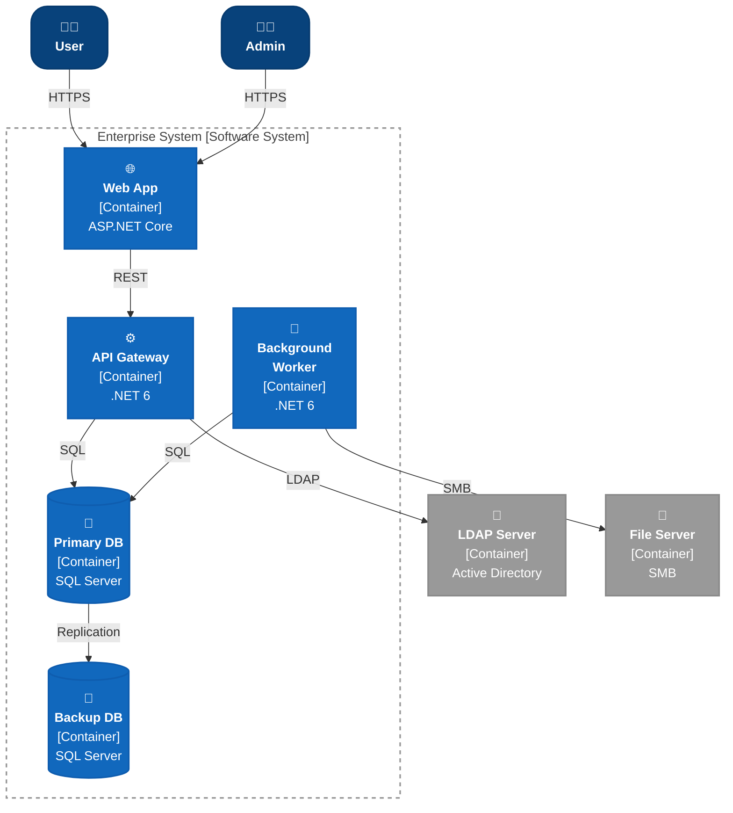
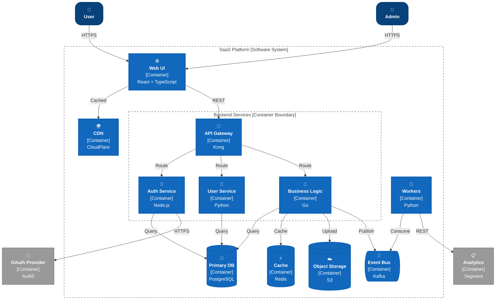
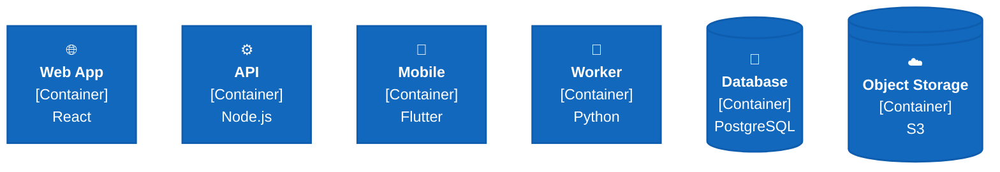
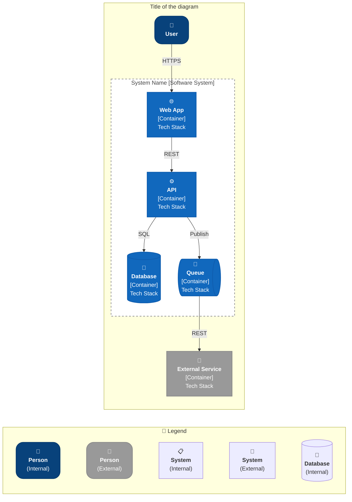

# C4 Container Diagram - Mermaid Flowchart Cheatsheet

> Container diagrams show the high-level technology choices within a software system. Containers represent deployable units (web apps, APIs, databases, microservices, etc.).

---

## Color Palette (C4 Blue Theme)

| Element                | Color       | Hex       | Internal | External |
| ---------------------- | ----------- | --------- | -------- | -------- |
| **Container**          | Medium Blue | `#1168bd` | ✓        | -        |
| **Container**          | Dark Gray   | `#999999` | -        | ✓        |
| **ContainerDb**        | Medium Blue | `#1168bd` | ✓        | -        |
| **ContainerDb**        | Dark Gray   | `#999999` | -        | ✓        |
| **ContainerQueue**     | Medium Blue | `#1168bd` | ✓        | -        |
| **ContainerQueue**     | Dark Gray   | `#999999` | -        | ✓        |
| **Container_Boundary** | Dashed Gray | `#999`    | -        | -        |
| **Text/Stroke**        | Dark Gray   | `#073b6f` | -        | -        |

---

## C4 PlantUML Elements → Mermaid Flowchart Mapping

| C4 PlantUML Element       | Mermaid Class       | Element Type              | Example   |
| ------------------------- | ------------------- | ------------------------- | --------- |
| `Container(...)`          | `Container`         | Container (Internal)      | Element 1 |
| `Container_Ext(...)`      | `ContainerExt`      | Container (External)      | Element 2 |
| `ContainerDb(...)`        | `ContainerDb`       | ContainerDb (Internal)    | Element 3 |
| `ContainerDb_Ext(...)`    | `ContainerDbExt`    | ContainerDb (External)    | Element 4 |
| `ContainerQueue(...)`     | `ContainerQueue`    | ContainerQueue (Internal) | Element 5 |
| `ContainerQueue_Ext(...)` | `ContainerQueueExt` | ContainerQueue (External) | Element 6 |
| `Container_Boundary(...)` | `ContainerBoundary` | Container Boundary        | Element 7 |

---

## Element Index & Legend

All Container-level elements shown together, plus the C4-PlantUML macro each one maps to. Grab the matching `classDef` line(s) and node/subgraph syntax from the legend below — every snippet is self-contained and renders standalone.



| #   | C4 PlantUML                                     | Mermaid class                  | Shape      | Usage                                                 |
| --- | ----------------------------------------------- | ------------------------------ | ---------- | ----------------------------------------------------- |
| 1   | `Container(alias, label, tech, descr)`          | `Container`                    | rect       | Internal deployable unit                              |
| 2   | `Container_Ext(alias, label, tech, descr)`      | `ContainerExt`                 | rect       | External deployable unit                              |
| 3   | `ContainerDb(alias, label, tech, descr)`        | `ContainerDb`                  | cylinder   | Internal database/data store                          |
| 4   | `ContainerDb_Ext(alias, label, tech, descr)`    | `ContainerDbExt`               | cylinder   | External database/data store                          |
| 5   | `ContainerQueue(alias, label, tech, descr)`     | `ContainerQueue`               | rect       | Internal message broker/queue                         |
| 6   | `ContainerQueue_Ext(alias, label, tech, descr)` | `ContainerQueueExt`            | rect       | External message broker/queue                         |
| 7   | `Container_Boundary(alias, label) { ... }`      | `ContainerBoundary` (subgraph) | dashed box | Groups containers within a system/deployment boundary |

---

## Complete Container Diagram Example 1: E-Commerce Microservices



---

## Complete Container Diagram Example 2: Enterprise Web Application



---

## Complete Container Diagram Example 3: Cloud-Native SaaS



---

## Styling Combinations

### Container with Technology Labels



---

## Best Practices for Container Diagrams

### ✅ DO's

- **Show deployable units** — Each container is independently deployable
- **Include technology stack** — Node.js, Python, PostgreSQL, etc.
- **Group by deployment boundary** — Use Container_Boundary for related containers
- **Use consistent technology abbreviations** — React, FastAPI, MySQL
- **Indicate data flow** — Show which containers talk to each other
- **Include database containers** — Databases are first-class deployment units

### ❌ DON'Ts

- **Don't show class diagrams** — That's the Component level
- **Don't mix Container and Component details** — Stay at the Container level of abstraction
- **Don't show internal API endpoints** — Keep labels simple
- **Don't create overly dense diagrams** — Aim for 5-15 containers per diagram
- **Don't forget technology labels** — They're essential context

---

## Copy-Paste Template: Complete Container Diagram



---

## Container Diagram Layers (C4 Model)

```text
Level 1: System Context     → Systems & People
Level 2: Container          ← YOU ARE HERE (Deployable units)
Level 3: Component          → Internal components
Level 4: Code               → Classes, functions
```

---

## Common Container Technology Stacks

| Container Type | Technologies                                | Examples         |
| -------------- | ------------------------------------------- | ---------------- |
| **Web App**    | React, Vue, Angular, Svelte                 | SPA Frontend     |
| **API**        | Node.js, Python, Java, Go, C#               | REST, GraphQL    |
| **Worker**     | Python, Node.js, Go, C#                     | Background jobs  |
| **Database**   | PostgreSQL, MySQL, MongoDB, SQL Server      | Data persistence |
| **Cache**      | Redis, Memcached, Elasticsearch             | Performance      |
| **Queue**      | RabbitMQ, Kafka, AWS SQS, Azure Service Bus | Async messaging  |
| **Mobile**     | React Native, Flutter, Swift, Kotlin        | Mobile app       |
| **Desktop**    | Electron, WinForms, WPF                     | Desktop app      |
