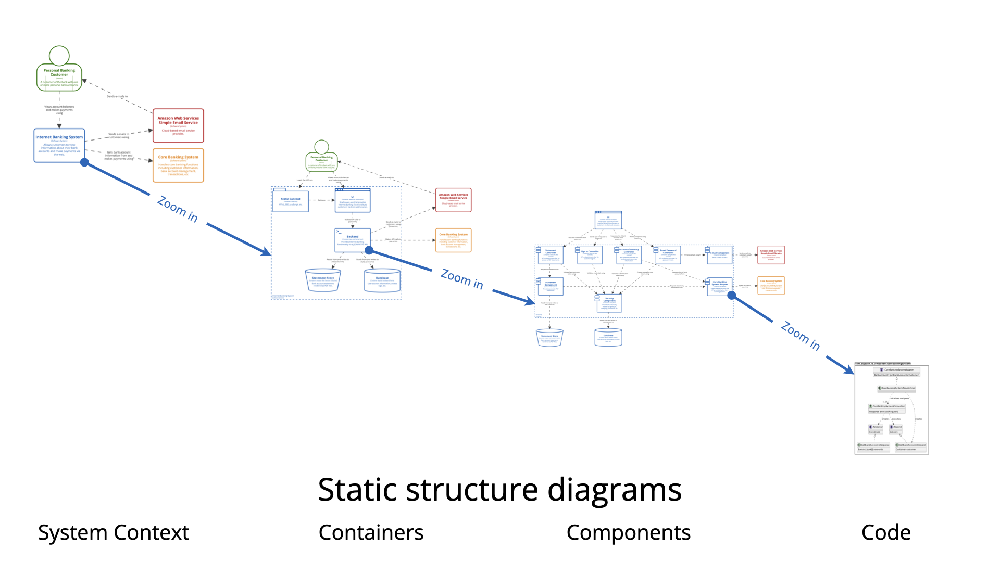

# C4 Modeling (Mermaid Flowchart Edition)

> ⚠️ **Release Candidate (RC)** — This is not yet a final release. Cheatsheets, examples, and styling are still being refined. Feedback and contributions are welcome. Expect minor changes to syntax, colors, or structure before v1.0.

A collection of **Mermaid flowchart-based cheatsheets** for drawing C4 model architecture diagrams using plain, controllable syntax instead of Mermaid's native (but limited) C4 diagram types.

## What is C4 Modeling?

**C4** is a hierarchical approach to architecture diagramming developed by [Simon Brown](https://simonbrown.je/). It defines four levels of abstraction:

- **Context (Level 1):** The system and its environment — people, external systems, enterprise boundaries.
- **Container (Level 2):** Deployable units — applications, APIs, databases, message queues, services.
- **Component (Level 3):** Internal structure of a container — controllers, services, repositories, handlers.
- **Code (Level 4):** Implementation details — classes, functions, packages, and dependencies within a component.

For more details, visit the **[official C4 model documentation](https://c4model.com/)** and the **[Diagrams guide](https://c4model.com/diagrams)** to see all diagram types. Also explore **[C4-PlantUML](https://github.com/plantuml-stdlib/C4-PlantUML)**, the reference implementation used by architects worldwide.

### The Four Core Diagram Levels



## Why not mermaid's native C4 diagrams?

Mermaid ships built-in `C4Context`, `C4Container`, `C4Component`, and `C4Dynamic` diagram types modeled after C4-PlantUML. In practice they are **not workable yet** for real documentation:

- Styling support (`UpdateElementStyle` / `UpdateBoundaryStyle`) is partial and renders inconsistently (or not at all) across GitHub, VS Code, and other Mermaid versions.
- No reliable icon/emoji support inside elements.
- Boundaries (`System_Boundary`, `Enterprise_Boundary`) frequently misrender, nest badly, or ignore layout hints.
- Directional relationship hints (`Rel_U`, `Rel_D`, `Rel_L`, `Rel_R`) are often ignored by the layout engine, leaving tangled diagrams with no manual override.
- No fine control over spacing, per-element colors, or shapes (databases, queues, etc.).

**Workaround used here:** every C4 diagram is modeled with a generic Mermaid `flowchart`, using `classDef`/`class` for C4-style coloring and `subgraph` for boundaries. This gives full control over layout, color, and shape while staying visually consistent with official C4-PlantUML notation. Each element below also lists the C4-PlantUML macro it corresponds to, so anyone coming from PlantUML can find the matching style immediately.

## Files in this folder

| File                                                                                                                          | Covers                                             | Use it when you need to draw...               |
| ----------------------------------------------------------------------------------------------------------------------------- | -------------------------------------------------- | --------------------------------------------- |
| [C4-Context-Diagram-Mermaid-Flowchart-Cheatsheet.md](./C4-cheatsheets/C4-Context-Diagram-Mermaid-Flowchart-Cheatsheet.md)     | People, systems, system/enterprise boundaries      | Level 1 — the system(s) in their environment  |
| [C4-Container-Diagram-Mermaid-Flowchart-Cheatsheet.md](./C4-cheatsheets/C4-Container-Diagram-Mermaid-Flowchart-Cheatsheet.md) | Containers (apps, APIs, databases, queues)         | Level 2 — deployable units inside one system  |
| [C4-Component-Diagram-Mermaid-Flowchart-Cheatsheet.md](./C4-cheatsheets/C4-Component-Diagram-Mermaid-Flowchart-Cheatsheet.md) | Components (controllers, services, repositories)   | Level 3 — internal structure of one container |
| [C4-Relationships-Layouts-Cheatsheet.md](./C4-cheatsheets/C4-Relationships-Layouts-Cheatsheet.md)                             | Relationship (`Rel`/`BiRel`) and layout directives | Arrows, direction, and grouping at any level  |

## How each cheatsheet is structured

1. **Color Palette** — the shared C4 blue theme (internal = blue/dark blue, external = gray).
2. **Element Index & Legend** — one consolidated diagram showing every element type for that level, plus a table mapping each one back to its C4-PlantUML macro (`Person(...)`, `Container(...)`, `Component(...)`, `Rel(...)`, ...).
3. **Complete Diagram Examples** — ready-to-copy samples ranging from a small 3-4 element diagram to large, multi-layer/multi-subgraph diagrams (microservices, SaaS platforms, IoT systems).
4. **Best Practices** — do's and don'ts specific to that diagram level.
5. **Copy-Paste Template** — a blank skeleton to start a new diagram from scratch.

## Quick usage

1. Pick the diagram level (Context / Container / Component), or open the Relationships cheatsheet for arrows/layout.
2. Find the element in that file's **Element Index & Legend** table.
3. Copy the matching `classDef` line(s) and node/subgraph syntax — every snippet is self-contained and renders standalone.
4. Use a **Complete Diagram Example** as a starting skeleton for anything bigger than a couple of elements.

## Mermaid rendering tip

Add this to your renderer config (e.g. `mermaid.config` / front-matter) for more readable flowcharts:

```yaml
mermaid:
  startOnLoad: true
  theme: base
  flowchart:
    useMaxWidth: true
    rankSpacing: 100
    nodeSpacing: 50
    padding: 15
```

## Use These Cheatsheets with GitHub Copilot

This repo also ships ready-to-use [GitHub Copilot customizations](https://code.visualstudio.com/docs/copilot/customization/overview) so you can generate C4 diagrams that follow these exact conventions directly in your own project's Copilot Chat.

| Artifact                                                                         | What it does                                                                                    | Install into your project                                                                         |
| -------------------------------------------------------------------------------- | ----------------------------------------------------------------------------------------------- | ------------------------------------------------------------------------------------------------- |
| [c4-mermaid-diagrams skill](.github/skills/c4-mermaid-diagrams/)                 | Auto-triggers on requests like "create a C4 diagram" and picks the right level/conventions      | Copy the whole `.github/skills/c4-mermaid-diagrams/` folder into your project's `.github/skills/` |
| [/c4-context, /c4-container, /c4-component, /c4-relationships](.github/prompts/) | Slash commands for generating one diagram level at a time                                       | Copy the files in `.github/prompts/` into your project's `.github/prompts/`                       |
| [C4 Architect agent](.github/agents/c4-architect.agent.md)                       | Interviews you about a system and produces a linked Context → Container → Component diagram set | Copy `.github/agents/c4-architect.agent.md` into your project's `.github/agents/`                 |

The skill is **self-contained**: it bundles its own copies of the 4 cheatsheets under `references/`, so copying just that one folder is enough — it doesn't depend on the rest of this repo. The prompts and agent reference the skill's bundled files, so install the skill alongside them.

> Currently targets GitHub Copilot only (`.github/`). Support for other assistants (e.g. Claude, via `.claude/skills/`) is planned once this proves useful.
